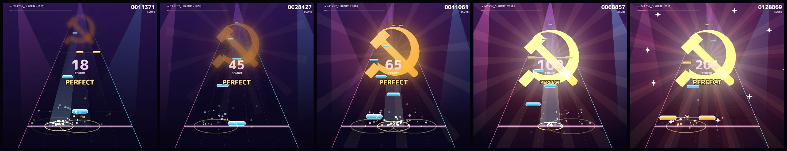

# MusicTapGame

スマホのブラウザで遊べる音ゲー。手持ちの mp3 などを読み込むと、曲を解析して譜面を自動で作る。
曲と譜面は端末の中(IndexedDB)だけに保存し、外には送らない。

**▶ 遊ぶ: https://t-kumamoto.github.io/MusicTapGame/**(ホーム画面に追加するとアプリのように全画面で遊べる)

配布用ファイルセット(zip)は [リリース](https://github.com/T-Kumamoto/MusicTapGame/releases/latest) からダウンロードできる。



## 遊び方

1. 初期曲を選ぶか、「＋ 曲を追加」で音楽ファイル(mp3 / m4a / wav / ogg)を選ぶ
2. 難易度(EASY / NORMAL / HARD / EXPERT)を選んで LIVE START
3. 判定ラインに来たノーツを叩く

| ノーツ | 色 | 操作 |
|---|---|---|
| タップ | 水色 | 叩く |
| 同時押し | 金色 | 線でつながったノーツを同時に叩く |
| ロング | 緑 | 押したまま終点まで(隣のレーンへのずれは許容) |
| フリック | ピンク(矢印) | 叩いてそのまま指を弾く |

PC ではキーボードの `1` `2` `3` `4` `5`(または `D` `F` `Space` `J` `K`)でも遊べる(フリックは押すだけで成功)。

## 演出

| 条件 | 演出 |
|---|---|
| 10 コンボごと | 鎌と金槌が一段大きくなり、画面奥から中央へ寄る(100 コンボで最大) |
| 50 コンボ以上 | 鎌と金槌がずっと輝く |
| 100 コンボ以上 | さらに眩しく、光線が増える |
| 200 コンボ以上 | 赤い光線が逆回転で重なり、星が周りを回る |
| MISS が 8 連続 | 画面が凍りつき「シベリア送り」 |
| MISS が全体の 3 割以上 | リザルトが「シベリア送り」 |

しきい値は `js/soviet.js` の先頭で変えられる。

## タイミング

初めて遊ぶ時は **設定 → タイミング調整** で判定のずれを測っておくと快適。
Bluetooth イヤホンは遅延が大きいので特に必要。

## 初期曲

初回起動時にライブラリへ入る曲。

| 曲 | クレジット |
|---|---|
| ソ連国歌 | すーぱーういるす / [ニコニ・コモンズ nc241752](https://commons.nicovideo.jp/works/nc241752)(利用許可範囲: ネット全般) |
| モルドバ国歌 | [Wikimedia Commons](https://commons.wikimedia.org/)(パブリックドメイン) |
| 沿ドニエストル共和国国歌 | [Wikimedia Commons](https://commons.wikimedia.org/)(パブリックドメイン) |

同梱曲の追加方法は [songs/README.md](songs/README.md)。

## 開発

ビルド不要の素の ES Modules。ローカルでは静的サーバーで開く(ES Modules は `file://` では動かない)。

```bash
python -m http.server 8765
```

テスト(Node 20 以上):

```bash
npm test
```

配布用ファイルセット(アプリ本体だけを `dist/MusicTapGame/` と zip に出力。https で配信できる静的サーバーならどこでも動く):

```bash
npm run build
```

### 構成

| ファイル | 役割 |
|---|---|
| `js/main.js` | 画面遷移・曲ライブラリ・設定 |
| `js/game.js` | 判定とスコア(描画・入力に依存しない) |
| `js/renderer.js` | Canvas で奥行きレーン・ノーツ・演出・HUD を描く |
| `js/soviet.js` | 鎌と金槌・シベリア送りの演出 |
| `js/input.js` | マルチタッチ/キーボード → レーン操作 |
| `js/audio.js` | 再生と、出力遅延を差し引いた曲の時計 |
| `js/storage.js` | IndexedDB(曲)と localStorage(設定) |
| `js/chart/analyze.js` | 帯域別オンセット・音量・スペクトル重心・BPM/拍位置の推定 |
| `js/chart/generate.js` | 難易度別の譜面組み立て |
| `js/chart/worker.js` | 解析を Web Worker で実行 |
| `sw.js` / `manifest.webmanifest` | PWA(ホーム画面に追加・オフライン起動) |

### 譜面生成のしくみ

1. 低音・中音・高音の 3 帯域でスペクトラルフラックス(音の立ち上がり)を取る
2. オンセット包絡の自己相関で BPM の候補を出し、櫛形フィルタで BPM と最初の拍の位置を詰める。
   同時に動的計画法(Ellis 2007)で拍を一つずつ追いかけ、テンポが揺れる曲(生演奏・国歌など)はそちらを使う
3. 拍と拍の間を 4 等分した 16 分音符のグリッドごとに、周囲より目立つ立ち上がりの強さ × 盛り上がり(音量)× 拍の重み で点数を付ける
4. 難易度ごとの密度目標まで、点数の高い順に最小間隔を守って採用する
5. 伸びている音はロング、フレーズの締めはフリック、表拍の強いキックは同時押しにする
6. レーンは音の高さ(スペクトル重心)が上がれば右、下がれば左へ動かす。乱数はファイルの内容から作るので、同じ曲なら毎回同じ譜面になる

手元の mp3 で解析結果を確かめるには `npm run analyze -- <曲.mp3>`。
アルゴリズムを変えたら `js/storage.js` の `CHART_VERSION` を上げる(保存済みの譜面が作り直される)。

## ロードマップ

- [x] 判定・リトライの不具合修正、ファイル分割、Canvas 描画、タイミング調整
- [x] 譜面生成の作り直し(帯域別オンセット + BPM グリッド + 決定的なレーン配置)
- [x] 奥行きレーン、ロング/フリック/同時押し、ヒット演出、リザルト画面
- [x] PWA 化
- [x] テンポが揺れる曲への対応(動的計画法による拍追跡)
- [x] 初期曲(ソ連・モルドバ・沿ドニエストル国歌)
- [x] 鎌と金槌・シベリア送りの演出
- [ ] 必要なら Capacitor で Android アプリ化

## 免責事項 / Disclaimer

本作は純粋なプログラミング学習およびエンターテインメントを目的とした技術デモ・個人制作物です。特定の国家、地域、政治体制、思想信条を支持・賞賛・批判・宣伝する意図は一切ありません。

This project is an educational and entertainment technology demo. It does not advocate, endorse, or promote any specific country, region, political ideology, or regime.
